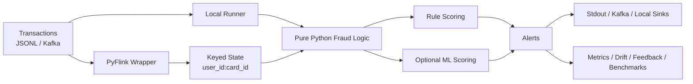

# PyFlink Fraud Detection Streaming

A portfolio-grade streaming system for suspicious card transaction detection with **PyFlink**, stateful feature engineering, and explainable risk scoring.

It mirrors a production-style flow while keeping the fraud logic in normal, testable Python:

```text
Kafka transactions
        ↓
PyFlink streaming job
        ↓
stateful per-user features
        ↓
risk scoring and alert generation
        ↓
Kafka / stdout / downstream store
```

## Architecture



Detailed notes live in [`docs/architecture.md`](docs/architecture.md).

## What Works Now

- Pure-Python fraud logic separated from Flink runtime wiring
- Stateful per-user and per-card features for real-time scoring
- Explainable alerts with human-readable fraud reasons
- Local runner and tests that do not require Flink or Kafka
- Kafka producer/consumer CLIs and a Docker Compose streaming demo
- Offline ML training, model blending, feature parity checks, replay, drift monitoring, and analyst feedback export
- CI workflow, Docker publishing workflow, AWS templates, and Flink operations docs

## Quick Evaluation

If you want to evaluate the repository in under five minutes, start here:

```bash
poetry install --with dev
make quality
poetry run python -c "import sys; sys.path.insert(0, 'src'); from fraud_streaming.cli import main; raise SystemExit(main(['data/sample_transactions.jsonl', '--show-all']))"
```

Then inspect:

- architecture walkthrough: [`docs/architecture.md`](docs/architecture.md)
- 5-minute demo script: [`docs/demo-script.md`](docs/demo-script.md)
- local runner sample: [`docs/samples/local_runner_output.jsonl`](docs/samples/local_runner_output.jsonl)
- high-risk alert sample: [`docs/samples/high_risk_alert.json`](docs/samples/high_risk_alert.json)
- metrics sample: [`docs/samples/metrics_example.prom`](docs/samples/metrics_example.prom)
- drift sample: [`docs/samples/drift_report_example.md`](docs/samples/drift_report_example.md)

## Why this project is useful

Fraud detection is a strong PyFlink use case because it needs:

- low-latency decisions as transactions arrive;
- keyed state per user, card, or account;
- rolling-window behaviour such as transaction velocity;
- late-event and event-time thinking;
- explainable alerts that can be reviewed by analysts.

Apache Flink is built for stateful computations over bounded and unbounded streams, and its Python DataStream API supports stream transformations such as filtering, state updates, windows, and aggregation.

## Repository layout

```text
.
├── src/fraud_streaming/
│   ├── schemas.py          # Typed transaction, feature, state, and alert models
│   ├── features.py         # Stateful feature engineering
│   ├── rules.py            # Explainable fraud scoring rules
│   ├── serialization.py    # JSON parsing and alert serialization
│   ├── local_runner.py     # Local non-Flink runner for development and tests
│   ├── flink_job.py        # PyFlink DataStream job
│   └── cli.py              # Command-line entrypoints
├── scripts/
│   └── generate_transactions.py
├── tests/
├── data/
│   └── sample_transactions.jsonl
├── docs/
│   ├── architecture.md
│   ├── demo-script.md
│   └── samples/
├── infra/aws/
├── docker-compose.yml
├── Dockerfile
└── ROADMAP.md
```

## Production Trade-Offs

This repository is intentionally strong on:

- stateful feature engineering
- explainable fraud reasons
- testability without heavy infrastructure
- operational documentation and extension points

It is intentionally cautious about:

- pretending synthetic labels are real fraud ground truth
- claiming the AWS templates are production-complete
- claiming the Iceberg path is universally runnable without environment-specific work
- overbuilding the PyFlink wrapper into a full deployment platform

## Quick Start Without Flink

This mode is useful for reviewing the project and testing the fraud logic.

```bash
poetry install --with dev
make quality
poetry run pytest
poetry run fraud-local data/sample_transactions.jsonl
```

Or with plain Python:

```bash
python -m venv .venv
source .venv/bin/activate
pip install -e . pytest
pytest
python -m fraud_streaming.cli data/sample_transactions.jsonl
```

Useful local shortcuts:

```bash
make quality
make test
make local-demo
```

See [`CONTRIBUTING.md`](CONTRIBUTING.md) for the local development workflow and optional extras.
See [`docs/iceberg-sink.md`](docs/iceberg-sink.md) for the local sink abstraction and Iceberg design notes.
See [`infra/aws/README.md`](infra/aws/README.md) for AWS deployment templates and security notes.
<!-- CI badge placeholder: add the repository-specific GitHub Actions badge URL once the default remote is finalized. -->

## CI parity

GitHub Actions CI runs the same default quality gates used locally on Python `3.10`, `3.11`, and `3.12`:

```bash
poetry install --with dev
poetry run ruff format --check src tests scripts
poetry run ruff check src tests scripts
poetry run mypy src
poetry run pytest
```

The default CI workflow intentionally avoids Kafka, Flink, Docker, and Iceberg extras so pull requests can be validated without external services.

## Optional Demos

These are useful after the local path:

- Kafka-first local demo with Redpanda and Flink: see the Docker Compose section below
- ML training and model-aware scoring
- replay, drift monitoring, analyst feedback export, and benchmarks
- AWS deployment templates under [`infra/aws/`](infra/aws/README.md)

## Generate Synthetic Transactions

```bash
python scripts/generate_transactions.py --output data/generated_transactions.jsonl --users 20 --transactions 500 --seed 7
python -m fraud_streaming.cli data/generated_transactions.jsonl --show-all
```

## Produce Transactions To Kafka

Install the optional Kafka extra:

```bash
poetry install --with dev -E kafka
```

Publish existing JSONL events:

```bash
poetry run fraud-produce-transactions \
  --bootstrap-servers localhost:9092 \
  --topic transactions \
  --input data/sample_transactions.jsonl
```

Or generate and stream synthetic events progressively:

```bash
poetry run fraud-produce-transactions \
  --bootstrap-servers localhost:9092 \
  --topic transactions \
  --users 20 \
  --transactions 500 \
  --seed 7 \
  --sleep-ms 100 \
  --key-field user_id
```

The producer validates each event with the same canonical transaction schema used by the local runner and the Flink wrapper.

## Consume Fraud Alerts From Kafka

With the Kafka extra installed, you can inspect the alert stream produced by the Flink job:

```bash
poetry run fraud-consume-alerts \
  --bootstrap-servers localhost:9092 \
  --topic fraud-alerts \
  --group-id fraud-demo \
  --from-beginning \
  --max-messages 20 \
  --summary
```

Optional filters:

```bash
poetry run fraud-consume-alerts \
  --bootstrap-servers localhost:9092 \
  --topic fraud-alerts \
  --risk-level high \
  --min-risk-score 70
```

## Run The PyFlink Job Locally

Install the optional Flink dependency first:

```bash
poetry install --with dev -E flink
```

Then run against a local JSONL file source:

```bash
poetry run pyflink-fraud-job \
  --source file \
  --input data/sample_transactions.jsonl \
  --sink stdout
```

For Kafka:

```bash
poetry run pyflink-fraud-job \
  --source kafka \
  --bootstrap-servers localhost:9092 \
  --input-topic transactions \
  --output-topic fraud-alerts
```

The Kafka path assumes the required Flink Kafka connector is available to the Flink runtime. In managed Flink environments this is normally configured at the cluster/job level.

To enable explicit event-time watermarks and late-event handling:

```bash
poetry run pyflink-fraud-job \
  --source kafka \
  --bootstrap-servers localhost:9092 \
  --input-topic transactions \
  --output-topic fraud-alerts \
  --watermark-max-out-of-orderness-ms 30000 \
  --allowed-lateness-ms 5000 \
  --late-event-policy drop
```

With those flags:

- timestamps are extracted from the canonical transaction `event_time`
- bounded out-of-orderness watermarks are enabled
- events older than the current watermark beyond the allowed lateness are dropped when `--late-event-policy=drop`
- default behaviour remains unchanged when watermark flags are omitted

Connector setup notes and troubleshooting live in [`docs/flink-kafka-connectors.md`](docs/flink-kafka-connectors.md).
Operational notes for checkpointing, savepoints, keyed state, and recovery live in [`docs/flink-operations.md`](docs/flink-operations.md).

## Docker Compose Streaming Demo

The repository includes a local streaming demo profile with:

- Redpanda as the Kafka-compatible broker
- a standalone Flink JobManager and TaskManager
- optional producer and consumer containers

Bring up the broker and Flink services:

```bash
make compose-up
```

Seed the `transactions` topic:

```bash
make produce-demo
```

Submit the Kafka-to-Kafka PyFlink job:

```bash
make run-flink-kafka-demo
```

Read alerts back from Kafka:

```bash
make consume-alerts
```

Tear the demo down:

```bash
make compose-down
```

Important connector note:

- The compose demo does not bundle the Flink Kafka connector JAR automatically.
- Place a Flink `1.19.x` compatible Kafka connector JAR under [`docker/flink/connectors`](docker/flink/connectors/README.md) before running the full Kafka/Flink path.

Validation status:

- `docker compose config` was used as the configuration-level validation target in the agent environment.
- Full end-to-end execution with a real connector JAR still needs manual verification on a machine with Docker available.

## Local Docker Image

Build the project image locally:

```bash
docker build -t pyflink-fraud-detection-streaming:local .
```

Run the default local demo command inside the image:

```bash
docker run --rm pyflink-fraud-detection-streaming:local
```

Override the command to process a mounted transaction file:

```bash
docker run --rm \
  -v "$(pwd)/data:/app/data" \
  pyflink-fraud-detection-streaming:local \
  data/sample_transactions.jsonl --show-all
```

Publishing notes:

- GitHub Actions publishes the image only for tags matching `v*.*.*` and manual workflow dispatch.
- The default target registry is GitHub Container Registry, using `ghcr.io/<owner>/<repo>`.
- Normal branch pushes do not publish Docker images.

## AWS Deployment Templates

The repository now includes documentation-first AWS examples under [`infra/aws/`](infra/aws/README.md) for:

- Amazon MSK as the Kafka-compatible transport
- Amazon Kinesis Data Streams as an AWS-native stream transport
- Amazon Managed Service for Apache Flink deployment considerations
- Amazon S3 plus AWS Glue Catalog for Iceberg-oriented analytical storage

Important scope note:

- these are portfolio-grade templates and placeholders, not one-click production deployments
- all values under `infra/aws/env/*.example` are placeholders only
- the Terraform files are a coherent skeleton for names, tags, VPC inputs, and storage identifiers, not a fully provisioned streaming stack
- the managed-cloud validation checklist for a real AWS environment lives in [`infra/aws/managed-validation.md`](infra/aws/managed-validation.md)

## Sample Outputs

Checked-in examples from real runs in this repository:

- local runner output: [`docs/samples/local_runner_output.jsonl`](docs/samples/local_runner_output.jsonl)
- alert example: [`docs/samples/high_risk_alert.json`](docs/samples/high_risk_alert.json)
- metrics example: [`docs/samples/metrics_example.prom`](docs/samples/metrics_example.prom)
- drift example: [`docs/samples/drift_report_example.md`](docs/samples/drift_report_example.md)

## Example Input Event

```json
{
  "transaction_id": "tx-000001",
  "user_id": "user-001",
  "card_id": "card-001",
  "merchant_id": "merchant-042",
  "amount": 42.50,
  "currency": "EUR",
  "country": "PT",
  "device_id": "device-001",
  "merchant_category": "grocery",
  "event_time": "2026-06-10T12:00:00Z",
  "channel": "pos",
  "is_card_present": true
}
```

## Example Alert

```json
{
  "transaction_id": "tx-000020",
  "user_id": "user-001",
  "card_id": "card-001",
  "event_time": "2026-06-10T12:07:30+00:00",
  "risk_score": 85,
  "risk_level": "high",
  "reasons": [
    "transaction velocity is high",
    "amount is unusual for the user",
    "country changed recently"
  ]
}
```

## Dead-Letter Handling For Malformed Events

The local runner can keep processing valid events while writing malformed rows to a dead-letter JSONL file:

```bash
poetry run fraud-local data/sample_transactions.jsonl \
  --show-all \
  --dead-letter-output data/dead_letter.jsonl
```

Dead-letter records preserve:

- the raw event payload
- the parse error, if JSON decoding failed
- structured quality check failures
- the ingestion timestamp

Current quality checks cover missing required fields, invalid amounts, invalid timestamps, unsupported currencies, empty user/card identifiers, future event timestamps beyond tolerance, and duplicate transaction IDs within a local batch.

## Local Metrics Export

The local runner can also write Prometheus text format metrics:

```bash
poetry run fraud-local data/sample_transactions.jsonl \
  --show-all \
  --metrics-output data/fraud_metrics.prom
```

The exported metrics include:

- processed transactions
- emitted alerts
- high-risk alerts
- malformed events
- average risk score
- event counts by country, channel, and risk level

Example output:

```text
# HELP fraud_transactions_processed_total Total number of successfully processed transactions.
# TYPE fraud_transactions_processed_total counter
fraud_transactions_processed_total 8
# HELP fraud_average_risk_score Average risk score of successfully processed transactions.
# TYPE fraud_average_risk_score gauge
fraud_average_risk_score 18.125
```

## Local File Sinks And Iceberg-Ready Extension Points

The local CLI still defaults to stdout alerts, but it can now also write validated transactions and emitted alerts to file sinks:

```bash
poetry run fraud-local data/sample_transactions.jsonl \
  --show-all \
  --alert-sink jsonl \
  --alert-output artifacts/alerts.jsonl \
  --transaction-sink jsonl \
  --transaction-output artifacts/transactions.jsonl
```

Optional Parquet output requires `pyarrow`:

```bash
pip install pyarrow
poetry run fraud-local data/sample_transactions.jsonl \
  --show-all \
  --alert-sink parquet \
  --alert-output artifacts/alerts.parquet
```

The repository also includes an explicit Iceberg sink extension point with honest limitations documented in [`docs/iceberg-sink.md`](docs/iceberg-sink.md). The local fallback for runnable demos remains JSONL or Parquet.

## Offline ML Training Baseline

The repository now includes an optional offline training pipeline that reuses the same streaming-style feature logic used during local processing.

Install the ML extra:

```bash
poetry install --with dev -E ml
```

Train on sample or synthetic data:

```bash
poetry run fraud-train-model --input data/sample_transactions.jsonl
```

Or generate a larger synthetic training set on the fly:

```bash
poetry run fraud-train-model \
  --users 50 \
  --transactions 2000 \
  --seed 7 \
  --output-dir artifacts
```

Each run writes a versioned artifact directory containing:

- `model.pkl`
- `feature_schema.json`
- `metrics.json`
- `dataset_provenance.json`

The saved metrics include precision, recall, F1, ROC-AUC when the evaluation split contains both classes, and a threshold analysis table.

Important label note:

- If the input data includes a `label` field, it must be binary `0/1` or boolean.
- If no label is present, the pipeline creates synthetic demo labels from transparent heuristics so the ML workflow can be demonstrated.
- Those synthetic labels are not real fraud ground truth and should not be presented as such.

For a manually supplied labelled dataset with explicit provenance:

```bash
poetry run fraud-train-model \
  --input data/public/labelled_transactions.csv \
  --input-format csv \
  --label-column is_fraud \
  --dataset-name manual-public-labelled-set \
  --dataset-url https://example.com/dataset-card-fraud \
  --dataset-license "See upstream dataset terms" \
  --provenance-notes "Manual local download; not redistributed in this repository." \
  --require-input-labels
```

More guidance lives in [`docs/public-dataset-evaluation.md`](docs/public-dataset-evaluation.md).

## Model Scoring During Inference

Rule-only scoring remains the default. To enable model-aware scoring after training a model artifact:

```bash
poetry run fraud-local data/sample_transactions.jsonl \
  --scoring-strategy blend \
  --model-artifact artifacts/model-YYYYMMDDTHHMMSSZ/model.pkl
```

Available strategies:

- `rules`: existing explainable rule score only
- `model`: model probability scaled to `0-100`, while still attaching rule reasons
- `blend`: weighted average of rule score and model score

You can control the blend:

```bash
poetry run fraud-local data/sample_transactions.jsonl \
  --scoring-strategy blend \
  --model-artifact artifacts/model-YYYYMMDDTHHMMSSZ/model.pkl \
  --rule-weight 0.7 \
  --model-weight 0.3
```

Model artifacts fail fast if the stored raw feature schema does not match the canonical inference feature schema.

## Feature Parity Checks

To check offline-versus-inference feature parity on deterministic JSONL inputs:

```bash
poetry run fraud-check-feature-parity \
  --reference data/sample_transactions.jsonl \
  --current data/sample_transactions.jsonl \
  --output artifacts/feature_parity_report.json \
  --deterministic
```

The parity report checks:

- feature column presence
- feature column order against the canonical schema
- coarse dtype compatibility
- null-rate differences
- row-count agreement
- deterministic value differences when `--deterministic` is set

The command exits with a non-zero status when parity fails and always saves a JSON report.

## Replay Historical Streams

Replay historical JSONL transactions to stdout:

```bash
poetry run fraud-replay data/sample_transactions.jsonl --as-fast-as-possible
```

Preserve event-time spacing:

```bash
poetry run fraud-replay data/sample_transactions.jsonl --preserve-timing
```

Replay faster than wall-clock event spacing and filter the slice:

```bash
poetry run fraud-replay data/sample_transactions.jsonl \
  --speed-multiplier 10 \
  --start-time 2026-06-10T12:00:00Z \
  --end-time 2026-06-10T13:00:00Z \
  --user-id user-001
```

Dry-run the replay plan without emitting:

```bash
poetry run fraud-replay data/sample_transactions.jsonl --dry-run --speed-multiplier 20
```

You can also replay to a file or Kafka:

```bash
poetry run fraud-replay data/sample_transactions.jsonl --output-mode file --output-path data/replayed.jsonl
poetry run fraud-replay data/sample_transactions.jsonl --output-mode kafka --bootstrap-servers localhost:9092 --topic replay-transactions
```

## Drift Monitoring

Generate a drift report between a reference JSONL stream and a current JSONL stream:

```bash
poetry run fraud-drift-report \
  --reference data/sample_transactions.jsonl \
  --current data/sample_transactions.jsonl \
  --output artifacts/drift_report.json \
  --markdown-output artifacts/drift_report.md \
  --segment-by country \
  --segment-by channel
```

The report includes:

- PSI for fraud scores and selected numeric features
- mean and standard deviation deltas
- quantile deltas
- optional KS statistics when `scipy` is installed
- optional segment-level drift by country, merchant category, channel, and risk level

Interpretation note:

- These metrics are useful for portfolio-grade monitoring demonstrations, but small samples can make drift estimates noisy.

## Analyst Feedback Ingestion

Build an offline feedback report from alert JSONL output and analyst review JSONL records:

```bash
poetry run fraud-feedback-report \
  --alerts data/fraud_alerts.jsonl \
  --feedback data/analyst_feedback.jsonl \
  --output artifacts/feedback_report.json
```

Feedback records use these fields:

- `transaction_id`
- `reviewer_id`
- `label`: `true_fraud`, `false_positive`, or `needs_review`
- `comment`
- `reviewed_at`

The report includes:

- precision by risk level, using reviewed alerts
- false positive rate by human-readable rule reason
- reviewed and unreviewed alert counts
- unmatched feedback rows, so review data is not silently dropped

To prepare a retraining dataset export, add the original transaction stream:

```bash
poetry run fraud-feedback-report \
  --alerts data/fraud_alerts.jsonl \
  --feedback data/analyst_feedback.jsonl \
  --transactions data/sample_transactions.jsonl \
  --output artifacts/feedback_report.json \
  --retraining-output artifacts/retraining_feedback.jsonl
```

The retraining export joins canonical transaction-derived features, alert scores, analyst labels, and review metadata. `needs_review` items are preserved in the export with a null binary label instead of being silently coerced.

For a lightweight offline analyst review surface on top of the same feedback schema:

```bash
poetry run fraud-review-ui \
  --alerts data/fraud_alerts.jsonl \
  --feedback data/analyst_feedback.jsonl \
  --output artifacts/review.html
```

That command generates a self-contained HTML page that:

- filters alerts by risk level and review status
- preloads the latest existing feedback row per transaction
- lets a reviewer edit labels and comments locally in the browser
- exports canonical feedback JSONL for `fraud-feedback-report`

See [`docs/analyst-review-ui.md`](docs/analyst-review-ui.md).

## Benchmarks

Benchmark scripts live under [`benchmarks/`](benchmarks/). They are intentionally separate from unit tests and CI smoke checks.

Run the default local benchmark matrix:

```bash
make benchmark
```

Or call the script directly with custom scenario sizes:

```bash
poetry run python benchmarks/benchmark_local_runner.py \
  --users 10 \
  --users 100 \
  --transactions 1000 \
  --transactions 5000 \
  --repeats 3 \
  --output artifacts/benchmarks/local_runner_benchmark.json \
  --markdown-output artifacts/benchmarks/local_runner_benchmark.md
```

The benchmark report includes:

- events processed per second
- emitted alert count
- average, fastest, and slowest runtime
- peak memory from `tracemalloc`, unless disabled

An optional Kafka producer preparation benchmark is also available when the Kafka extra is installed:

```bash
poetry install --with dev -E kafka
poetry run python benchmarks/benchmark_local_runner.py \
  --users 20 \
  --transactions 2000 \
  --include-kafka-producer
```

Important benchmark note:

- `local_runner` measures the pure-Python fraud pipeline.
- `kafka_producer_prepare` measures local message preparation and publish-loop overhead with an in-memory producer stub, not broker throughput.

## Core Features

For each user/card stream, the project computes:

- transaction count in the last 5 minutes;
- transaction amount in the last 1 hour;
- minutes since previous transaction;
- amount z-score against user history;
- country change flag;
- device change flag;
- card-not-present flag;
- night-time transaction flag.

The default scoring is rule-based for transparency. This is intentional for a portfolio project: it shows the pipeline clearly before adding ML models.

## Future Roadmap

Completed roadmap stages and stretch ideas live in [`ROADMAP.md`](ROADMAP.md).
