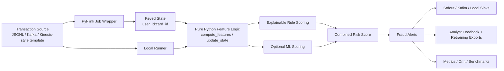

# Architecture

## Mermaid view

## Design intent

This repository separates the business logic from the stream runtime as aggressively as possible.

The important split is:

- `features.py`, `rules.py`, `schemas.py`, `serialization.py`, and ML helpers contain pure Python logic
- `flink_job.py` wires source, keyed state, checkpoint settings, and sink delivery

That separation makes it possible to:

- test the fraud logic without Kafka, Flink, or Docker
- run deterministic local demos
- reuse the same feature logic for offline training, parity checks, replay, drift monitoring, and feedback export

## Runtime path

The streaming runtime shape is:

1. ingest raw transaction events from file or Kafka
2. deserialize them into canonical `Transaction` records
3. key by `user_id:card_id`
4. restore per-key `UserProfileState`
5. compute stateful fraud features
6. score the transaction with rules and optional model blending
7. emit a canonical `Alert`
8. persist or forward alerts to stdout, Kafka, or local file sinks

## Stateful features

The current keyed state supports:

- rolling transaction velocity
- one-hour amount accumulation
- online mean and variance for amount z-score
- recent country and device changes
- time since last transaction

These are intentionally explainable features rather than opaque embeddings or black-box sequence models.

## Explainability path

Alerts carry:

- a numeric risk score
- a risk level
- human-readable reasons
- the feature snapshot used during scoring

That keeps the system reviewable by analysts and makes the sample outputs useful in a portfolio setting.

## Operational surfaces

The repository now includes supporting surfaces around the core job:

- Kafka producer and consumer CLIs
- replay support for historical event streams
- dead-letter handling and quality checks
- Prometheus-style local metrics
- offline ML training and parity checks
- drift monitoring
- analyst feedback ingestion and retraining export
- sink abstractions for stdout, JSONL, Parquet, and Iceberg-oriented extension points

## Production trade-offs

This project is intentionally honest about where it stops.

It demonstrates:

- sound separation of concerns
- stateful fraud features
- explainable scoring
- optional ML integration
- operational docs and templates

It does not claim:

- a fully production-ready AWS deployment
- a finished Iceberg writer for every catalog
- a label-rich real fraud dataset
- event-time watermark logic tuned for every lateness pattern

Those omissions are deliberate. The goal is a clean, portfolio-grade system that is easy to inspect and discuss, not a misleading “enterprise complete” template.
